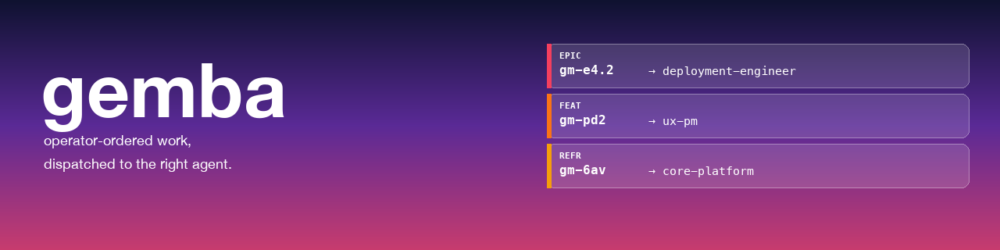
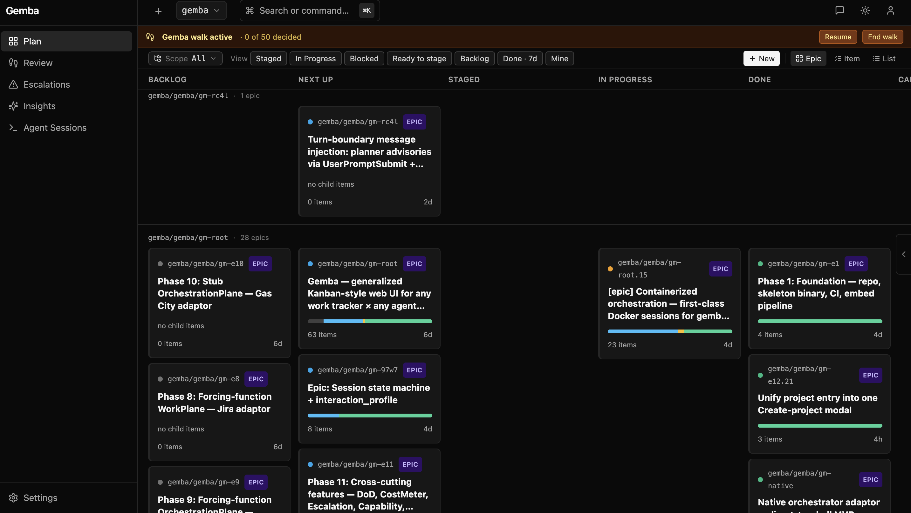
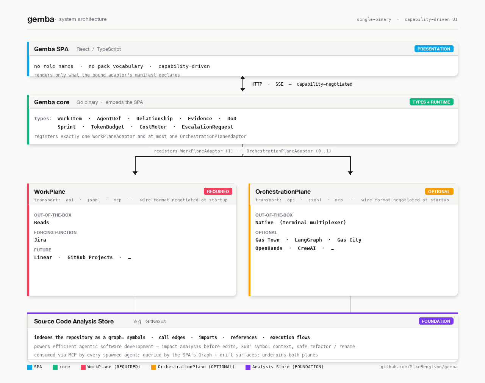

<a name="top"></a>

[](https://github.com/GembaCore/gemba-core)

# gemba

<p>
  <a href="https://github.com/GembaCore/gemba-core/actions/workflows/ci.yml"></a>&nbsp;
  <a href="https://github.com/GembaCore/gemba-core/actions/workflows/e2e.yml"></a>&nbsp;
  <a href="https://github.com/GembaCore/gemba-core/actions/workflows/docs.yml"></a>&nbsp;
  <a href="go.mod"></a>&nbsp;
  <a href="web/"></a>&nbsp;
  <a href="#"></a>&nbsp;
  <a href="LICENSE"></a>&nbsp;
  <a href="https://github.com/GembaCore/gemba-core/commits/main"></a>&nbsp;
  <a href="https://github.com/GembaCore/gemba-core/stargazers"></a>
</p>

⭐ **Star us on GitHub** — it helps people find this project and tells
us we're solving a real problem.

<p>
  <a href="https://x.com/intent/tweet?text=A%20single-binary%20Go%20%2B%20React%20Kanban%20that%20pairs%20any%20work%20tracker%20with%20any%20agent%20orchestrator:%20https%3A//github.com/GembaCore/gemba-core%20%23kanban%20%23agents%20%23golang"></a>&nbsp;
  <a href="https://www.linkedin.com/sharing/share-offsite/?url=https%3A%2F%2Fgithub.com%2FGembaCore%2Fgemba-core"></a>&nbsp;
  <a href="https://www.reddit.com/submit?url=https%3A%2F%2Fgithub.com%2FGembaCore%2Fgemba-core&title=A%20single-binary%20Kanban%20that%20pairs%20any%20work%20tracker%20with%20any%20agent%20orchestrator"></a>&nbsp;
  <a href="https://news.ycombinator.com/submitlink?u=https%3A%2F%2Fgithub.com%2FGembaCore%2Fgemba-core&t=A%20single-binary%20Kanban%20that%20pairs%20any%20work%20tracker%20with%20any%20agent%20orchestrator"></a>&nbsp;
  <a href="https://mastodonshare.com/?text=A%20single-binary%20Kanban%20that%20pairs%20any%20work%20tracker%20with%20any%20agent%20orchestrator&url=https%3A%2F%2Fgithub.com%2FGembaCore%2Fgemba-core"></a>
</p>

In lean manufacturing, gemba (/ˈɡem.bə/ 現場) is "the actual place" —
the factory floor, where real work happens. A gemba walk is when
leadership observes the work directly, not through reports, and leaves
actionable feedback as they go. Gemba is built around that metaphor.



Gemba features Kanban like planning, execution, and management of
complex vibe coding projects in a single pane of glass. Organize, review,
and dispatch large, parallel batches of work and monitor real progress
towards milestones, all with built-in coaching and drift detection.
Start a new project with a guided conversation or import your existing
work — see [Getting Started](#-getting-started) for a quick start.

## Table of Contents

- [🚀 About](#-about)
- [🧱 Architecture](#-architecture)
- [🎯 Two-Axis Work Planning and Dispatch](#-two-axis-work-planning-and-dispatch)
- [🚦 Status](#-status)
- [✨ What's New](#-whats-new)
- [📸 Screenshots](#-screenshots)
- [📦 Project Layout](#-project-layout)
- [🏁 Getting Started](#-getting-started)
- [🛠️ Development](#%EF%B8%8F-development)
- [📚 Documentation](#-documentation)
- [🤝 Feedback and Contributions](#-feedback-and-contributions)
- [📜 License](#-license)

## 🚀 About

Gemba was born out of frustration with the current state of vibe coding.
Massively parallel, "headless" agentic software development was
technically possible but it was cumbersome. Before Gemba, a single app
to manage the process using concepts and terms familiar to developers
did not exist - concepts like milestones, epics, and Kanban planning to
tie them together.  
Systems like Beads made it possible for agentic pipelines to discover,
claim and report work progress but these systems were not functionally
integrated with **execution** — ordering, dispatching, and monitoring
the work.

This left developers to face several obstacles in projects of any
appreciable scale:

- Planning is disconnected from execution — issues in Jira, Beads, or
  Todo.txt, agents in a terminal, output in git.
- Priority is invisible. The dep graph says what can run; nothing says
  what should run next.
- Expertise is siloed — a side-of-the-desk project needs product
  judgment, architecture, UX review, QA gating, release mechanics,
  security, and the operator doesn't have time to personally don each
  hat.
- State is fragile — git, Beads, LLM sessions, and sidecar artifacts
  each move on their own timeline; "undo back to yesterday" doesn't
  exist.
- Orchestration tooling is tied to one runtime — playing nicely with one
  tracker or one agent framework means a rewrite when either moves.

Gemba addresses all five: a browser-based UI for walking the floor of an
agentic project, seeing the work at the right grain, directing it, with
a roster of configurable LLM specialists a click away for the expertise
the operator doesn't have time to personally deliver for every decision.

In effect, Gemba creates a "side of the desk" experience for running
vibe coding projects, meaning complex multi-milestone projects spanning
weeks can be tackled while minimizing the cognitive load and freeing you
up to keep the creative flow going. It keeps you in the driver's seat
for what remains critical - high level planning, review, and course
correction - while allowing fully automated agentic software development
to take care of the execution.

The only hard requirement is a **data plane**.
[Beads](https://github.com/MikeBengtson/beads) fulfills that out of the
box, so the minimum working deployment is `gemba serve` and a browser
pointed at it — no orchestrator, no scheduling infrastructure required.
For teams that only need Beads viewing and management, `gemba serve
--beads-only` starts a deliberately smaller mode: no project, GitHub, or
agent runtime required. It opens the Beads board in a Flat list by
default, keeps Cascade and Graph views available, and records create /
edit / delete / state-change actions in a Beads history ledger. Add
`--beads-read-only` when the same views should be inspection-only:
Gemba shows a Beads-read-only status pill and rejects every mutation
before it reaches the Beads adaptor.
For the lowest-friction trial path, the self-contained Docker
quickstart image builds Gemba plus `bd`, seeds the sample project, and
starts Beads-only mode with one command: `make quickstart-run`.
For a real unseeded container, `make docker-run` builds the standard
Docker image with Gemba, the sentinel CLIs, `bd`, git/ssh, and mounted
`/data` + `/work` volumes.
**Native terminal orchestration is bundled** so operators who want agent
sessions don't need to install anything extra:
`gemba serve --orchestration=native` drives tmux / iTerm2 / Terminal.app
sessions directly, surfaces permission prompts and HITL requests in the
SPA, and correlates `bd` mutations back to the session that made them.
Gemba also supports existing orchestration solutions like Gas Town,
which can picked at launch using `--orchestration=<name>` when you need
its specific scheduling or isolation semantics.

## 🧱 Architecture



| Plane              | Required | Default                               | What it gives you                             |
| ------------------ | -------- | ------------------------------------- | --------------------------------------------- |
| WorkPlane          | ✅       | Beads (`bd`)                          | The data — work items, sprints, evidence, DoD |
| OrchestrationPlane | ❌       | Native (tmux / iTerm2 / Terminal.app) | Agent sessions, HITL, dispatch, escalations   |

- **WorkPlane is required.** Gemba won't boot without one — the SPA has
  nothing to render.
- **OrchestrationPlane is optional.** Running without it is a supported
  mode: Gemba becomes a human-driven Kanban over the WorkPlane.
  Starting sessions, surfacing escalations, and agent dispatch light up
  when an adaptor is wired. Use `--beads-read-only` when the WorkPlane
  itself should reject writes.
- **Native is the default OrchestrationPlane.**
  `gemba serve --orchestration=native` is the happy path and needs no
  external daemon; it drives terminal sessions directly.

Gemba's ranking layer has two distinct systems for distinct jobs.
**Selection** (`internal/planner/selection/`) is a pure-Go dispatch-time
scorer that decides which ready bead a session should take next; it runs
every dispatch loop and powers the `/coach` affinity grid.
**epic_order** (the PM persona's skill) is an LLM-driven planning
consult that ranks candidate epics for sprint composition; it lives at
`/sprints` and produces narrative recommendations with confidence
scores. See
[Dispatch vs Planning](https://gembacore.github.io/gemba-core/concepts/dispatch-vs-planning/).

[⬆ back to top](#top)

## 🚦 Status

**Milestone 3 — Native orchestration shipped (April 2026).** Gemba runs
end-to-end against a Beads rig with native terminal orchestration out of
the box; work items, escalations, and session state all round-trip
through the SPA. The Gas Town adaptor is optional.

Active work lives in the project's Beads rig (`bd list`). Top-level open
epics include token spending management (`gm-root.14`), the UI/SPA
build-out (`gm-e12`), and cross-cutting features (escalation surfacing,
evidence v2, DoD v2 — `gm-e11`).
[Design docs](https://gembacore.github.io/gemba-core/design/) capture
the durable architectural decisions; adaptor authoring references live
in [Adaptors](https://gembacore.github.io/gemba-core/adaptors/).

## 🏁 Getting Started

### New project (starting from scratch)

The primary path for operators starting a new project. Install Gemba,
run the server, and open a browser — Gemba redirects to `/new` on first
run, which lands on `/board` and opens the unified **Create-project**
modal:

```bash
make build                                               # or: brew install GembaCore/tap/gemba-core (once taps ship)
./bin/gemba serve
# -> http://127.0.0.1:7666  (redirects to /new on first run)
```

The Create-project modal scaffolds a new project (directory +
`git init` + `.gemba/workspace.toml` + beads database + initial commit)
in one step — no LLM required. After ratify, the new project becomes the
active workspace and you land on the empty board, ready to add work
items by hand or via the optional **Plan with the Onboarder →** CTA
(only shown when an LLM client is configured; see
[Configuration](docs/getting-started/configuration.md)). The Onboarder
is a conversational planner at `/onboard` that emits a fully-populated
Milestone → Epic → Bead tree in one ratification.

You can start a new project at any time — even from an existing
workspace — using the **+** affordance next to the project picker in the
top bar.

**Existing beads databases.** If Gemba finds a beads database that isn't
yet bound to a Gemba workspace (no `.gemba/workspace.toml`, or no git
repo), the project picker labels it with a _needs setup_ badge. Click it
and choose either **Create a new git repo here** or **Move it into an
existing git repo**.

### Advanced: importing existing work

If you have an existing Jira project, Beads workspace, or source-code
repo you want to bring into Gemba, use the legacy advanced import wizard
at `/bootstrap` while the Settings/import consolidation lands. For
existing Beads databases, the project picker's _needs setup_ bind flow is
the current preferred path.

For the common case of pointing Gemba at an existing Beads rig and
rendering it immediately:

```bash
make build
./bin/gemba serve --beads-dir <path-to-your-beads-rig>
# -> http://127.0.0.1:7666
```

Gemba reads the rig, renders the Kanban, tails state changes, and wires
the native terminal orchestrator by default. If you want a read-only /
human-driven board with no session controls, pass
`--orchestration=none`.

End-to-end setup (both `--beads-dir` CLI mode and writable `--dolt-url`
direct-SQL mode), explicit `--beads-read-only`, expected banner output,
and troubleshooting:
[Running Gemba against your work items](https://gembacore.github.io/gemba-core/getting-started/running-against-your-work-items/).

### Native terminal orchestration

Native is the default orchestration mode. Spell it explicitly when you
want the command to document that choice:

```bash
./bin/gemba serve --beads-dir <rig> --orchestration=native
```

On boot, the native adaptor auto-detects an available terminal backend
(tmux in priority order, then iTerm2, then Terminal.app) and exposes
`/sessions` in the SPA. Clicking "New session" for a bead or dragging a
runnable bead into **In Progress**:

1. Provisions a git worktree (`git worktree add -b bead/<id>`).
2. Runs `gemba install-bridge` in the worktree (idempotent merge into
   `.claude/settings.local.json`; installs the hook stanza + the
   `gemba-mcp` MCP server).
3. Spawns a terminal pane with the chosen agent (Claude Code by default;
   shell-only for operators driving the bead by hand).
4. Injects the project + epic + bead preamble through
   `core/prompt.Envelope`, including the interaction-profile section
   that governs question / blocker behaviour.

Permission prompts and HITL approvals that Claude Code raises surface
live in the SPA; operator answers route back to the terminal as input.
Coach and Manager skill output (`## Questions` / `## Blockers` via
`gemba-ask`) surfaces on the same escalations surface with kind/channel
distinguished.

### Native, with parallelism

Per-agent parallelism lets a single session of a capable agent type
carry multiple concurrent beads (gm-root.16). The default
`.gemba/agents.toml` (auto-seeded by ratify since `gm-root.24`) already
declares this for `claude`:

```toml
[[agent]]
name           = "claude"
binary         = "claude"
preamble       = "claude_md"
hooks          = "claude_code"
intra_parallel = true
max_parallel   = 4
```

Tune the cap or add a second agent type by editing the file. The schema
reference is in
[Agent setup](https://gembacore.github.io/gemba-core/getting-started/agent-setup/).

The dispatcher tries to reuse an existing capable session before
spawning a new pane; the SPA renders an `n/max` pill per pane plus a
global in-flight counter. Full detail: the
[Parallelism guide](https://gembacore.github.io/gemba-core/getting-started/parallelism/).

### Autonomous dispatch (sticky session pools)

Per-agent parallelism is the _capacity_ axis. Pools are the _continuity_
axis: long-lived sessions that survive across beads, carry warm context,
and pick up ready work on their own — no human drag, no fresh spawn per
bead.

Phase 0 is the default: no `pool.toml`, no daemons, identical behavior
to the basic flows above. Pools are opt-in.

**Native quickstart** (one persona, two pool members, agents.toml
already has `claude` with `max_parallel = 4`; add `codex` when you want
OpenAI Codex CLI sessions):

```toml
# pool.toml
[pool]
default_persona = "engineer-claude"
default_floor = 0.5
reserved_for_manual = 1

[pool.routing]
epic = "engineer-claude"
task = "engineer-claude"

[pool.local.engineer-claude]
size = 2
agent_type = "claude"
```

```bash
./bin/gemba serve --beads-dir <rig> --orchestration=native \
  --pool-config ./pool.toml
```

`/api/pools` shows live pool state; `/settings/pools` is the
adaptor-aware SPA editor (path picker, dropdowns, live TOML preview,
clamp warnings).

**Gas Town**: same shape but the scope axis is the rig name and the SPA
editor imports rigs/personas from `gt agents` and shells to
`gt rig create` / `gt polecat create` for adaptor-owned changes
(`gm-s47n.17` wires the SPA buttons; CLI works today).

```toml
[pool.gemba.engineer]
size = 3
agent_type = "claude"

[pool.lume.engineer]
size = 1
agent_type = "claude"
```

```bash
./bin/gemba serve --beads-dir <rig> --orchestration=gastown \
  --pool-config ./pool.toml
```

Full quickstart with verification + troubleshooting:
[Autonomous dispatch quickstart](https://gembacore.github.io/gemba-core/getting-started/autonomous-dispatch/).
Operational deep dive:
[Pool sizing and MaxParallel](https://gembacore.github.io/gemba-core/deployment/pool-sizing/).
Design: [`docs/design/session-pool.md`](docs/design/session-pool.md)

- [`docs/design/pool-editor.md`](docs/design/pool-editor.md).

### TLS

```bash
# Self-signed: ephemeral cert + fingerprint banner on boot
./bin/gemba serve --beads-dir <rig> --tls-self-signed

# Operator-supplied chain
./bin/gemba serve --beads-dir <rig> --tls-cert ./cert.pem --tls-key ./key.pem
```

### Optional: Gas Town, LangGraph, other orchestrators

When you want the scheduling or isolation semantics those stacks
provide, swap the orchestration flag:

```bash
./bin/gemba serve --beads-dir <rig> --orchestration=gastown
```

Gas Town's session lifecycle is implemented end-to-end (`gt sling` for
dispatch, `gt unsling`/`gt release` for end, `gt convoy list` for
session enumeration, `gt mail` for escalations) — see `gm-e7.9`.
Pause/Resume + ClaimNextReady remain `KindUnsupported` where gt's CLI
lacks the primitive (tracked as `gm-e7.10` / `gm-e7.11`).

Native, Gas Town, Gas City, LangGraph, CrewAI, OpenHands, Devin, and
Factory adaptors are mutually exclusive — exactly one or zero
OrchestrationPlane adaptors per `gemba serve` process.

### Shader interop smoke (gm-root.5)

`scripts/shader-interop.sh` exercises the full **encode → bd-store →
decode** round-trip against a live `gemba serve` + `bd` backend:

```bash
make build
bash scripts/shader-interop.sh

# Optional — also fire `gt sling` and watch for the polecat to hook.
SHADER_INTEROP_SLING=1 bash scripts/shader-interop.sh
```

[⬆ back to top](#top)

## ✨ What's New

### Recent (May 2026)

- **Scope status pills on live session cards** — operational context
  cards now show top-level health of the session scope: Git
  clean/dirty, upstream sync (`synced`, `ahead`, `behind`,
  `diverged`), and GitNexus analysis freshness against the checked-out
  `HEAD`. Dirty worktrees mark analysis stale because the graph cannot
  include uncommitted source.
- **Beads-only mode** (`gm-etq2` / `gm-4u4l`) — `gemba serve
  --beads-only` runs Gemba as a Beads viewer and manager without a
  project or orchestration plane. The board starts in **Flat** view with
  milestones, epics, decision beads, and work beads in one ordered list;
  **Cascade** shows the wrapper hierarchy; the shared **Order** control
  sorts by modified, created, edited, or ID; Graph remains available.
  Status shows Beads health and remote setup actions, while the RHP adds
  a **Beads history** tab backed by a JSONL session manifest. Create,
  edit, hard-delete, milestone wrapper, decision tag, and milestone tag
  authoring all stay available. `--beads-read-only` is the
  inspection-only variant: it implies Beads-only, switches the Status
  pill to **Beads-read-only**, hides write affordances, and hard-blocks
  create/edit/delete/state mutations.
- **Self-contained Docker quickstart** — `Dockerfile.quickstart`,
  `docker-compose.quickstart.yml`, and `make quickstart-run` package
  Gemba with the `bd` CLI and a seeded sample project. A new user can
  run the container, open `http://localhost:7666`, and explore Flat,
  Cascade, Refine, details, Status, Beads history, and Graph without
  installing the local developer toolchain. The sample intentionally
  leaves a few future items in Backlog so Refine demonstrates grooming
  instead of an empty clean-backlog state.
- **Standard Docker server image** — `Dockerfile`,
  `docker-compose.yml`, and `make docker-run` package unseeded Gemba
  with `bd`, git/ssh, and the sentinel CLIs for mounted worktrees or
  Dolt URL deployments.
- **Codex native agent driver** — `.gemba/agents.toml` can declare a
  `codex` agent type using `binary = "gemba-codex-driver"` and
  `preamble = "codex_exec"`. The driver runs `codex exec --json`,
  exposes session-scoped `gemba-mcp` tools for cooperative status,
  escalation, and skill-output telemetry, emits fallback `gemba-state`
  lifecycle frames, and closes the bead on success.
  It is intentionally one-shot: auto-dispatch starts a fresh Codex
  session when no active Codex work exists rather than reusing an idle
  pane.
- **Wrapper cascade dispatch** — dragging an epic or milestone into
  **In Progress** marks the wrapper active, stages backlog descendants,
  and dispatches currently unblocked runnable leaf beads up to the
  configured pool limit. Wrapper state reflects descendant state rather
  than running as agent work itself.
- **Simplified Board lanes + card status pills** — the default kanban
  now presents **Ready → In Progress → Done**. **Ready** combines
  canonical `unstarted` and `staged` work; cards expose the precise
  state with **Next up** / **Staged** pills plus actionable signals such
  as **Triage**, **Needs input**, **Review**, and **Ready**. Backlog is
  still available through `/refine` and the board toggle; canceled work
  stays in list/filter views.
- **Recent is now a Board named view** (`gm-uipx.18`) — the standalone
  `/recent` route remains as a deep link, but the sidebar no longer
  treats Recent as a top-level concern. Use the Board's **View →
  Recent** chip for the last-24h created-items list, or **Done · 7d**
  for recent completions.
- **Autonomous dispatch (sticky session pools)** (`gm-s47n.10`/`.11`/
  `.12`/`.16`) — long-lived agent sessions per `(scope, persona)` with
  `SessionReady` idle state, in-place recycle (no respawn), an idle-pane
  reaper, and a per-pool dispatch daemon that runs Layer-5 selection
  over the ready set. Adaptor-aware editor at `/settings/pools` (path
  picker, dropdowns, live TOML preview, clamp warnings). Phase 0
  zero-delta: opt-in by writing `pool.toml`. Quickstart:
  [Autonomous dispatch](https://gembacore.github.io/gemba-core/getting-started/autonomous-dispatch/).
- **Native orchestration is the default happy path** (`gm-native.x`,
  matured across the cycle) — `--orchestration=native` auto-detects tmux
  / iTerm2 / Terminal.app, provisions a git worktree per session,
  idempotently merges the bridge stanza into Claude Code's
  `settings.local.json`, and injects a project + epic + bead preamble
  through `core/prompt.Envelope`. Permission prompts and HITL approvals
  from Claude Code surface live in the SPA; operator answers route back
  to the terminal as input. No external daemon required.
- **Gas Town adaptor — session lifecycle, escalations, cost synthesis**
  (`gm-e7.x`) — `gt sling` / `gt unsling` / `gt convoy list` / `gt peek`
  / `gt mail` / `gt escalate close` all wired through the Gas Town
  orchestration adaptor (`gm-e7.9`), plus cost-meter synthesis from
  transcript tokens (`gm-e7.4`) and live escalation listing (`gm-e7.5`).
  Pause/Resume + ClaimNextReady remain `KindUnsupported` where the gt
  CLI lacks the primitive (tracked as `gm-e7.10` / `gm-e7.11`).
- **Triage workspace `/refine`** (`gm-3ofd` + descendants) — dedicated
  triage + refinement surface for `state_category=backlog` beads,
  distinct from the execution kanban. Density-rich tabular layout with
  age, suggested-epic, blockers, and `dispatch_status` columns; defer +
  dismiss actions with notes (`gm-mw5n`); single
  - bulk drop-into-epic (`gm-ju5o`); persona-driven milestone creation
    during refinement (`gm-yjst`). Replaces the
    `?layout=list&view=backlog` crutch.
- **Escalation visibility** (`gm-e11.3` and friends) — **Triage** pills
  on bead/epic cards when open escalations target that work, a
  Board-level banner with scope-aware count and link to the dedicated
  escalations page, and a hand-off dispatcher skill (`gm-e11.8.7`) so
  PM-class personas can route blockers to the right reviewer.
  Escalations are advisory by design — they surface, they don't halt.
- **Right-Hand Panel (RHP) detail-tab system** (`gm-root.22.x`) —
  unified URL-driven tab system replaces the legacy drawer
  infrastructure across Epic / WorkItem / RecommendOrder views. URL
  codec with kind-replace/stack semantics for deep-link navigation;
  per-route Help tab pinned in the panel; shared `<TabBar>` component
  for in-pane nav (`gm-e12.19.7`). Epic and WorkItem details include a
  Milestone → Epic → Work item breadcrumb when ancestry is known.
- **Insights with `/api/v1/metrics/series` time-series proxy**
  (`gm-e12.17.1`, `gm-e9m0`) — `/insights` ships a three-tile MVP on top
  of recharts (sprint burn-down, dispatch rate, escalation rate) backed
  by a Prometheus query proxy with capability-manifest gating.
  `/api/v1/metrics/series` is the public surface; the SPA hides tiles
  when no Prometheus URL is configured.
- **Milestones across the kanban + RHP** (`gm-98sq` / `gm-935r` /
  `gm-o2k9` / `gm-mqiz` / `gm-4se1` / `gm-yyo8`) — milestone child-epic
  panel inside the RHP detail view, drag-an-epic-onto-a-milestone to
  re-parent, milestone dropdown on epic detail, auto-close + notify when
  the last child closes, color stripe + M-pill on EpicCard, and
  selective milestone context threaded into the preamble for personas
  working under one.
- **Workflows API surface** (`gm-e12.22.2`) — `/api/workflows` lists
  active workflow runs and templates from the WorkPlane; underlying
  beads adaptor exposes the cooked + active distinction so the SPA can
  render the Workflow Library and Active runs without template/wisp
  polluting the Plan / Backlog surfaces.
- **Per-agent parallelism** (`gm-root.16`) — agent types declare
  `intra_parallel` + `max_parallel` in `.gemba/agents.toml`; a
  try-reuse-before-spawn dispatcher policy co-locates beads on capable
  panes; SPA shows per-pane pills + a global in-flight counter. See the
  [Parallelism guide](https://gembacore.github.io/gemba-core/getting-started/parallelism/).
- **TLS support** (`gm-e5.3`) — `--tls-self-signed` for instant HTTPS
  with a fingerprint banner, or `--tls-cert` / `--tls-key` for
  operator-supplied chains.
- **Provider-aware agent detail view** (`gm-e12.15`) — `/agents/:id`
  switches its panel based on `Workspace.kind` (worktree, container,
  k8s_pod, vm, exec, subprocess) so the affordances match the runtime.
- **AgentGroup board** (`gm-e12.8`) — `/agent-groups` renders one card
  per group with mode-dispatched visuals (static / pool / graph).
- **Sprint roster** (`gm-e11.5`) — `/sprints` list + `/sprints/:id`
  detail. Token-budget rollups deferred to `gm-root.14.1`.
- **Evidence synthesis library** (`gm-e11.6`) — git log + GitHub PR
  API + CI status collectors with parallel execution and partial-failure
  tolerance. `has_evidence` capability gates + synthesized-marker on
  beads (`gm-t4af`).

> See the
> [GitHub commit log](https://github.com/GembaCore/gemba-core/commits/main)
> for the full history.

### Coming soon

- **Insights expansion** — the current `/insights` MVP renders three
  Prometheus-backed tiles. Follow-up work adds more series (stuck
  sessions, token spend, escalation backlog) and returns Insights to
  first-order navigation once the proxy chain is mature enough for
  everyday use.
- **Workflow** — beads molecules surfaced as a first-class Gemba concept
  (Library / Active runs / Authoring + epic-gate enforcement). See
  [`docs/design/workflows.md`](docs/design/workflows.md) for the
  ratified UX.
  
## 📦 Project Layout

```
.
├── cmd/
│   ├── gemba/                    # Cobra root (serve, doctor, version, adaptor test, ...)
│   ├── gemba-bridge/             # hook-shim subprocess Claude Code (+ friends) invoke per lifecycle event
│   ├── gemba-state/              # session-status sentinel CLI (ready / working / prompting / stalled)
│   ├── gemba-ask/                # Coach/Manager question/blocker sentinel CLI
│   ├── gemba-codex-driver/       # one-shot Codex exec driver for native sessions
│   └── gemba-mcp/                # MCP-tool server variant of gemba-ask + gemba-state
├── core/                         # adaptor-agnostic types: WorkItem, AgentRef, Relationship, ...
├── internal/
│   ├── server/                   # chi router, handlers, OpenAPI spec
│   ├── events/                   # SSE hub, GembaEvent schema, OTEL propagation
│   ├── auth/                     # bind policy, token, TLS, OIDC interface
│   ├── transport/                # api / jsonl / mcp adaptor hosts
│   ├── evidence/                 # shared evidence-synthesis library (git log, gh PR, CI)
│   └── adapter/
│       ├── noop/                 # in-memory reference (both planes)
│       ├── bd/                   # WorkPlane: Beads (CLI + direct Dolt SQL modes)
│       ├── native/               # OrchestrationPlane: native tmux / iTerm2 / Terminal.app (default)
│       ├── mock/                 # OrchestrationPlane: deterministic in-process acceptance runner
│       ├── gt/                   # OrchestrationPlane: Gas Town (optional)
│       ├── jira/                 # WorkPlane: Jira (forcing-function)
│       ├── langgraph/            # OrchestrationPlane: LangGraph (forcing-function)
│       └── gascity/              # OrchestrationPlane: Gas City (stub)
├── web/                          # Vite + React + TypeScript + Tailwind + shadcn/ui SPA
│   └── src/
│       ├── api/                  # codegenned client + types
│       ├── capabilities/         # capability-manifest readers + JSX gates
│       ├── pages/                # Board, Refine, Sessions, Sprints, AgentGroups, AgentDetail, ...
│       ├── components/           # Board, RHP detail tabs, sessions, project picker, ...
│       └── extensions/           # adaptor-namespaced widgets (gated by capability manifest)
├── testing/                      # public conformance harness (importable as github.com/GembaCore/gemba-core/testing)
│   ├── fixtures/                 # JSON fixtures used by the harness + scripts/
│   └── e2e/                      # Playwright specs + page objects
├── docs/
│   ├── adaptors/                 # per-adaptor authoring docs + conformance reports
│   ├── design/                   # durable conventions (parallelism-boundary, milestone-convention, ...)
│   ├── getting-started/          # operator-facing guides
│   ├── api/                      # OpenAPI 3.1 spec served at /api/openapi.json
│   └── img/                      # diagrams referenced from docs + README
├── docs-site/                    # Astro Starlight build of docs/, deployed to GitHub Pages
├── branding/                     # banner + social-preview PNGs + Pillow generator
├── scripts/                      # dev/CI shell helpers (run.sh, shader-interop.sh, ...)
├── .github/workflows/            # CI, e2e, docs, release
├── embed.go                      # //go:embed of web/dist (must live above web/, can't be moved deeper)
├── Makefile
└── go.mod
```

[⬆ back to top](#top)

## 🛠️ Development

The repo ships a single `Makefile` covering the full dev/build/release
loop. From a fresh clone:

```bash
make help         # list every target with one-line docs
make dev          # Vite + Go server, both with hot reload (needs: air, pnpm)
make build        # build the SPA, embed it, produce ./bin/gemba
make test         # go test -race ./... + pnpm test --run
make lint         # golangci-lint + pnpm lint
make release      # local goreleaser snapshot (multi-OS/arch tarballs in ./dist)
make clean        # remove bin/, dist/, web/dist/*, web/node_modules
```

Tooling expected on `PATH`:

- **Go** (see `go.mod` for the minimum version)
- **[`pnpm`](https://pnpm.io/installation)** — frontend package manager
- **[`air`](https://github.com/air-verse/air)** — Go hot reload for
  `make dev` (`go install github.com/air-verse/air@latest`)
- **[`golangci-lint`](https://golangci-lint.run/usage/install/)** —
  `make lint`
- **[`goreleaser`](https://goreleaser.com/install/)** — `make release`

> [!TIP] `make dev` runs Vite (port 5173) and the Go server (port 7666)
> with hot reload on both sides. The Vite dev server proxies `/api` and
> `/events` to the Go process so you can edit and see changes end-to-end
> without manual rebuilds.

[⬆ back to top](#top)

## 📚 Documentation

The full docsite is published at
**<https://gembacore.github.io/gemba-core/>**.

| Where                                                                      | What                                                                                                                                |
| -------------------------------------------------------------------------- | ----------------------------------------------------------------------------------------------------------------------------------- |
| [Getting Started](https://gembacore.github.io/gemba-core/getting-started/) | Operator-facing guides — running against your work items, parallelism configuration                                                 |
| [Adaptors](https://gembacore.github.io/gemba-core/adaptors/)               | Per-adaptor authoring docs + conformance reports — how to write a new WorkPlane / OrchestrationPlane                                |
| [Design](https://gembacore.github.io/gemba-core/design/)                   | Durable architectural decisions — parallelism boundary, milestone convention, Gemba walk (review of work in progress), persona PPPP |
| [Agents](https://gembacore.github.io/gemba-core/agents/)                   | Per-role agent operating docs                                                                                                       |
| [UI spec](https://gembacore.github.io/gemba-core/ui-spec/)                 | The SPA spec — every surface, every affordance, every test-id                                                                       |

> [!NOTE] Gemba captures decisions as `decision`-type beads with a `D#:`
> numbered prefix (matching the milestone convention `M1` / `M2`). Every
> decision is paired with a design doc that captures the ratified
> contract; the linkage is CI-enforced via `make lint-decisions` and a
> `--docs-only` check on every PR. See
> [Decision process](https://gembacore.github.io/gemba-core/design/decision-process/)
> for the lifecycle (draft → in_review → ratified | rejected) and worked
> examples.

[⬆ back to top](#top)

## 🤝 Feedback and Contributions

We've tried to make every architectural seam — adaptor boundaries,
capability gating, transport plurality — explicit and inspectable. Where
we got it wrong, your feedback is the fastest path to fixing it.

> [!IMPORTANT] Bug reports, feature suggestions, and architecture
> critiques are all welcome. The high-leverage things to share: **what
> you tried**, **what you expected**, and **what actually happened**, in
> roughly that order.

- 🐛 [File an issue](https://github.com/GembaCore/gemba-core/issues/new)
  — bugs, feature requests, design feedback
- 💬
  [Open a discussion](https://github.com/GembaCore/gemba-core/discussions)
  — questions, design conversations, "how would you …" threads
- 🔧 [Pull requests](https://github.com/GembaCore/gemba-core/pulls) —
  start with a draft if the change is non-trivial; we'd rather review
  the design before the code

If you're writing a new adaptor, the conformance harness is the shortest
path to "does it work": see the
[WorkPlane authoring guide](https://gembacore.github.io/gemba-core/adaptors/workplane/)
or the
[OrchestrationPlane authoring guide](https://gembacore.github.io/gemba-core/adaptors/orchestration/).

### Git hooks (optional)

The repo ships a versioned pre-commit hook at
`scripts/git-hooks/pre-commit` that runs prettier on staged Markdown
files (`--prose-wrap always --print-width 72`) and re-stages anything it
reformats. Install once per clone:

```bash
make install-hooks       # → git config core.hooksPath scripts/git-hooks
make uninstall-hooks     # restore default
```

Tolerant: the hook skips silently if `web/node_modules/.bin/prettier`
isn't present (e.g. you haven't run `pnpm install` in `web/` yet) and
never blocks a commit.

[⬆ back to top](#top)

## 📜 License

[MIT](LICENSE) © Gemba contributors.

This means: use it, fork it, ship it, no attribution required beyond the
LICENSE file in your distribution. Pull requests welcome under the same
terms.

[⬆ back to top](#top)
