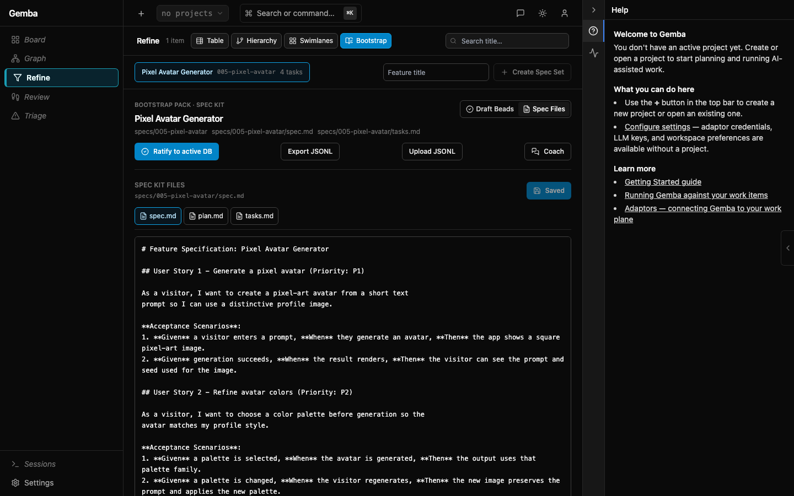
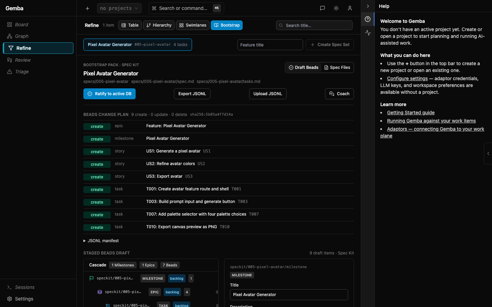
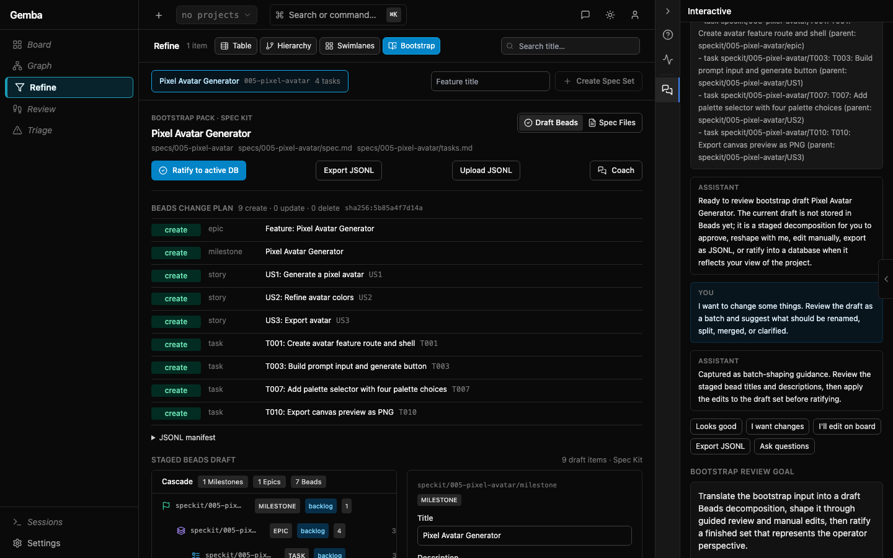
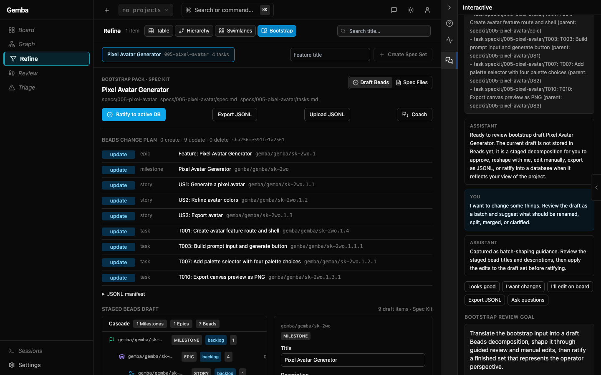
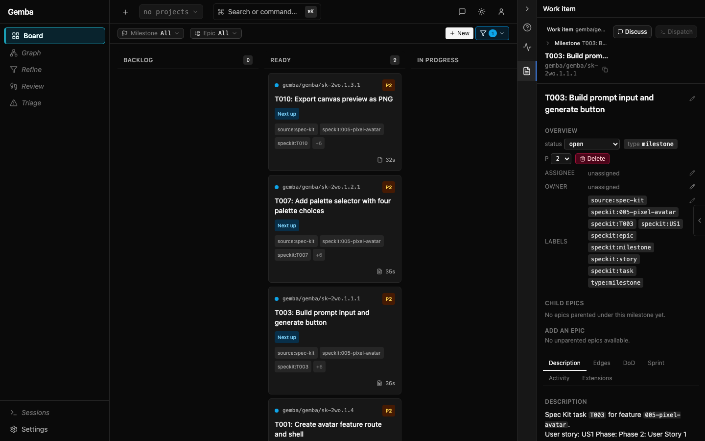
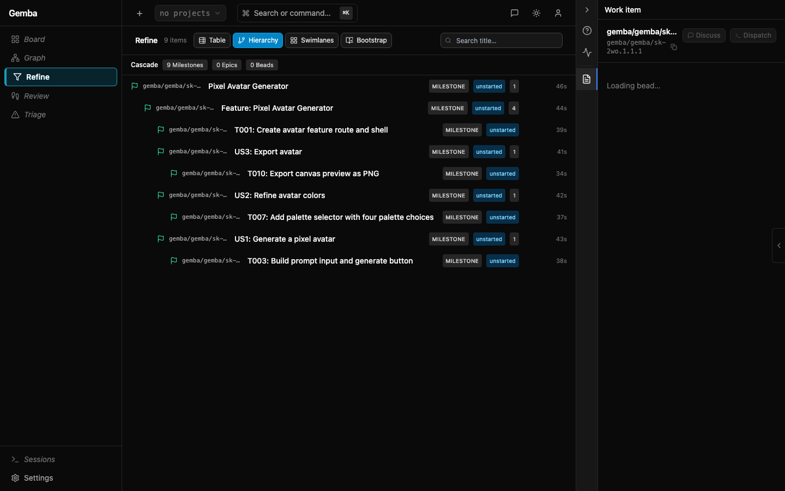
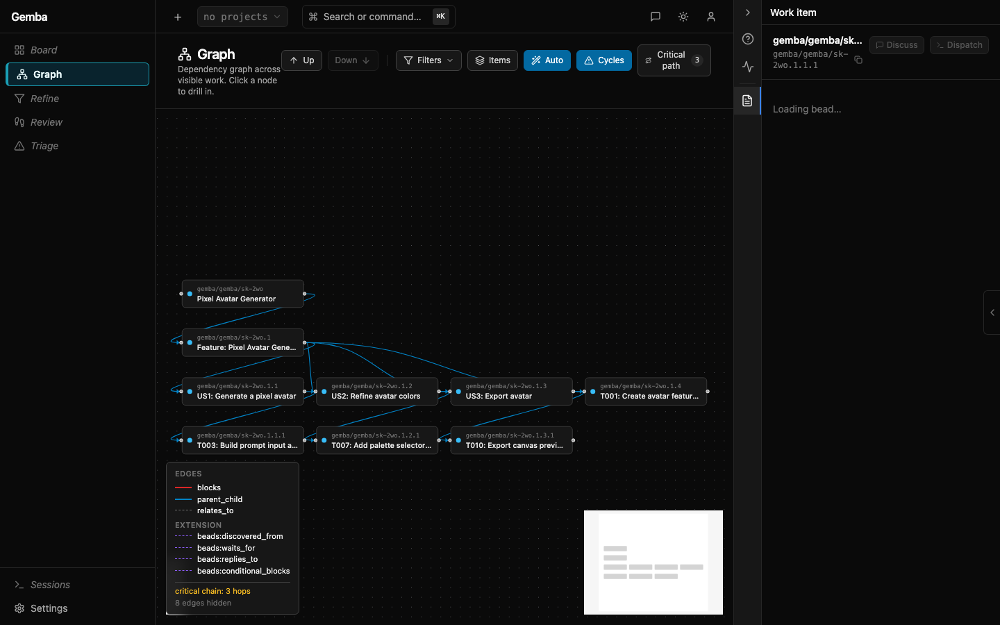

# Working With Spec Kit

Spec Kit can feed Gemba's Beads planning model as a **bootstrap pack**.
Use it when you want a feature specification, user-story plan, and
implementation task list to become reviewed Beads work without
hand-copying every story and task.

Gemba treats Spec Kit as a planning source. Beads remain the work system
of record, and generated items remain **drafts** until you ratify them
into a selected Beads database.

## What Gemba Reads

Gemba scans the project worktree for Spec Kit feature directories in
either location:

- `specs/<feature-id>/`
- `.specify/specs/<feature-id>/`

Each feature directory may contain:

- `spec.md` for the feature title, user stories, acceptance scenarios,
  and functional requirements.
- `plan.md` for plan provenance and operator context.
- `tasks.md` for `T###` implementation tasks.

The upstream Spec Kit task template groups work by user story, uses the
format `T### [P] [US#] Description`, and defines `[P]` as parallel-safe
work in different files with no dependency overlap. Gemba preserves
those markers as Beads traceability metadata.

## Mapping To Beads

Gemba projects one Spec Kit feature into this draft Beads hierarchy:

| Spec Kit artifact | Beads item |
|---|---|
| Feature directory | Milestone |
| Feature-level requirements | Epic under that milestone |
| `User Story #` in `spec.md` | Story under the feature epic |
| `T###` row in `tasks.md` | Task under the matching story when `[US#]` is present |

Setup and foundational tasks without `[US#]` are parented under the
feature epic. If a feature has no parsed user stories, Gemba creates a
fallback story so tasks still have a stable planning parent.

Every synced item receives traceability labels:

- `source:spec-kit`
- `speckit:<feature-id>`
- `speckit:milestone`, `speckit:epic`, `speckit:story`, or
  `speckit:task`
- `speckit:US#` for stories and story-owned tasks
- `speckit:T###` for implementation tasks
- `speckit:parallel` for `[P]` tasks

The same values are mirrored into custom fields where the active
WorkPlane supports them.

## Bootstrap From Scratch

1. Create or adopt the project worktree.
2. Initialize Spec Kit and generate at least one feature with `spec.md`
   and `tasks.md`, or let Gemba create the scaffold from the Bootstrap
   tab.
3. Initialize Beads for the worktree, or start Gemba with a Beads/Dolt
   source that points at an empty database.
4. Start Gemba:

   ```bash
   gemba serve --project-dir /path/to/project --open
   ```

5. Open **Refine**, switch to **Bootstrap**, and choose the Spec Kit
   feature.
6. Use **Spec Files** to review or edit `spec.md`, `plan.md`,
   `tasks.md`, and scaffold templates in place.
7. Review the staged Beads draft in the cascade view.
8. Open **Coach** to reshape the set as a batch, or edit individual
   draft items on the right.
9. Click **Ratify to active DB** when the draft matches your intent, or
   click **Export JSONL** to keep it as a portable Beads manifest.

The first ratification creates the milestone, epic, stories, and tasks.
Before that click, nothing has been written into the Beads database.
From that point forward, Beads are the operational surface for dispatch,
dependency review, coaching, and progress tracking.

## Container Beads-Only Mode

Spec Kit boot/editing needs a mounted project worktree because Gemba
must read and write `specs/` and `.specify/`. Use `--project-dir` /
`GEMBA_PROJECT_DIR`, not a Dolt URL, when you want the Spec Kit editor
surface.

Run the published container against a local project that contains
`.beads/` and may contain `specs/`:

```bash
cd /path/to/your/project

docker run --rm -it \
  --name gemba-spec-kit-beads \
  -p 7666:7666 \
  -v gemba-data:/data \
  -v "$PWD:/work" \
  -e GEMBA_BEADS_ONLY=true \
  -e GEMBA_PROJECT_DIR=/work \
  soflo1/gemba-core:latest
```

Open the printed `Open:` URL, then go to **Refine** -> **Bootstrap**.
If `/work/specs/...` already exists, Gemba loads those feature sets. If
not, click **Initialize Spec Kit**, then **Create Spec Set**.

The equivalent raw server command inside a container is:

```bash
gemba serve \
  --listen 0.0.0.0:7666 \
  --auth token \
  --beads-only \
  --project-dir /work \
  --orchestration none
```

## Add To Existing Beads

Use the same flow against an existing Beads database. Gemba only
reconciles Beads with both `source:spec-kit` and the matching
`speckit:<feature-id>` label, so unrelated backlog items are left alone.

This lets you introduce Spec Kit incrementally:

1. Add `specs/<feature-id>/spec.md` and `tasks.md`.
2. Open **Refine** -> **Bootstrap**.
3. Review the create/update/delete plan and the staged draft set.
4. Use the RHP coach for batch changes if the decomposition does not
   match how you want the project represented.
5. Ratify after the plan and draft match your intent.

## Editing Spec Kit In Gemba

The Bootstrap tab is also a small Spec Kit workspace editor. The left
toolbar lists feature spec sets and includes **Create Spec Set**. The
**Spec Files** tab opens the selected feature's files across the top of
the editor, followed by shared
`.specify/` templates and constitution files. Save writes the edited
text back into the project worktree; the Beads draft remains staged
until you ratify it separately.

If the project has no Spec Kit files yet, click **Initialize Spec Kit**.
Gemba creates `specs/` plus a minimal `.specify/` scaffold in the active
`--project-dir`. Use **Create Spec Set** to start a new
`specs/<feature-id>/` directory with `spec.md`, `plan.md`, and
`tasks.md`. This is useful for incremental specs: edit the source files,
review the refreshed draft, adjust with the coach or cascade editor, and
ratify only when the generated Beads reflect your current intent.



After the source files look right, switch back to **Draft Beads** to
review the generated hierarchy before ratification.



## Iterative Sync

Spec Kit can be applied repeatedly. Gemba compares the current
artifacts with previously synced Beads by trace labels and produces a
staged plan:

- **Create** when a milestone, epic, story, or task exists in Spec Kit
  but has no matching Bead.
- **Update** when a matching Bead exists and should be refreshed from
  the current artifact text.
- **Delete** when a previous `source:spec-kit` Bead for that feature no
  longer appears in the Spec Kit artifacts.

The preview includes a plan hash. The ratify endpoint requires that
hash, so a stale browser tab cannot apply a plan after the files or
Beads have changed. Plans with deletes require explicit stale-delete
approval in the UI before Gemba applies them.

## Guided Review

The **Coach** button opens a bootstrap-scoped RHP interaction. Gemba
seeds the interaction with the goal and the full Spec Kit context:
feature title, source paths, user stories, acceptance scenarios,
functional requirements, tasks, plan hash, change counts, and the draft
item tree.

Prepared reply bubbles cover common review moments:

- **Looks good** asks for a final readiness check.
- **I want changes** asks the coach to suggest batch renames, splits,
  merges, or clarifications.
- **I'll edit on board** tells the coach you will make manual cascade edits.
- **Export JSONL** keeps the draft portable without committing it.
- **Ask questions** asks the coach to surface missing clarification
  before ratification.

The coach can help reshape the set, but database writes still happen
only when you ratify the draft or use a separate `bd import`.



## After Ratification

Ratifying a Spec Kit draft writes the approved milestone, epic, stories,
and tasks into the active Beads database. The source trace labels stay
attached, so the generated items can be found later from Board, Cascade,
Graph, and detail surfaces.



Board detail shows the generated Bead as normal operational work:



Cascade keeps the milestone -> epic -> story -> task shape visible:



Graph shows the same generated work in dependency and relationship
context:



## JSONL Drafts

The Bootstrap panel includes JSONL preview, export, and upload. Use
export when you want a Beads-compatible manifest without writing to a
database:

```bash
bd import --dry-run spec-kit-manifest.jsonl
bd import spec-kit-manifest.jsonl
```

The manifest uses stable synthetic IDs such as
`speckit/001-auth/T001`, so repeated imports can upsert the same
feature work. Direct `bd import` is useful for create/update recovery,
but the Gemba ratification path is preferred because it stages deletes
and checks the plan hash before mutating Beads.

You can also upload a Beads JSONL file back into the Bootstrap panel.
Uploaded items are treated as a draft set: inspect them in cascade,
edit details, then ratify into the active database or re-export JSONL.

## Coach And Planning Use

Spec Kit also gives coaches better planning signals:

- Story independence from Spec Kit's user-story structure.
- Acceptance criteria from `spec.md`.
- Parallelism hints from `[P]` task markers.
- Source drift checks from trace labels and custom fields.

Coaches should treat `[P]` as a planning hint, not a dispatch order.
Gemba's normal dependency, file-conflict, and session-capacity checks
still decide what can run safely.

## Troubleshooting

If the Bootstrap tab is empty, check that the feature directory is under
`specs/` or `.specify/specs/` beneath the same path passed to
`--project-dir`.

If ratification is disabled, wait for the change plan and draft set to
finish loading. If the plan includes deletes, approve stale deletes
after reviewing the list.

If ratification fails with a stale plan hash, reload the plan and review
the new change list before applying it.

## Upstream Extension

Gemba ships an upstream-ready Spec Kit extension package at
`integrations/spec-kit/gemba-sync/`.

Install it into a Spec Kit project with:

```bash
specify extension add --dev /path/to/gemba-core/integrations/spec-kit/gemba-sync
```

The extension registers an optional `after_tasks` hook. After
`tasks.md` generation it can stage the Gemba Beads sync plan
automatically and print the create / update / delete counts. By default
it does not apply changes; set `auto_apply: true` in
`.specify/extensions/gemba/gemba-config.yml` only when you want the hook
to POST the approved plan hash back to Gemba.

Delete plans are still protected: auto-apply refuses deletes unless
`allow_deletes: true` is set after review.
